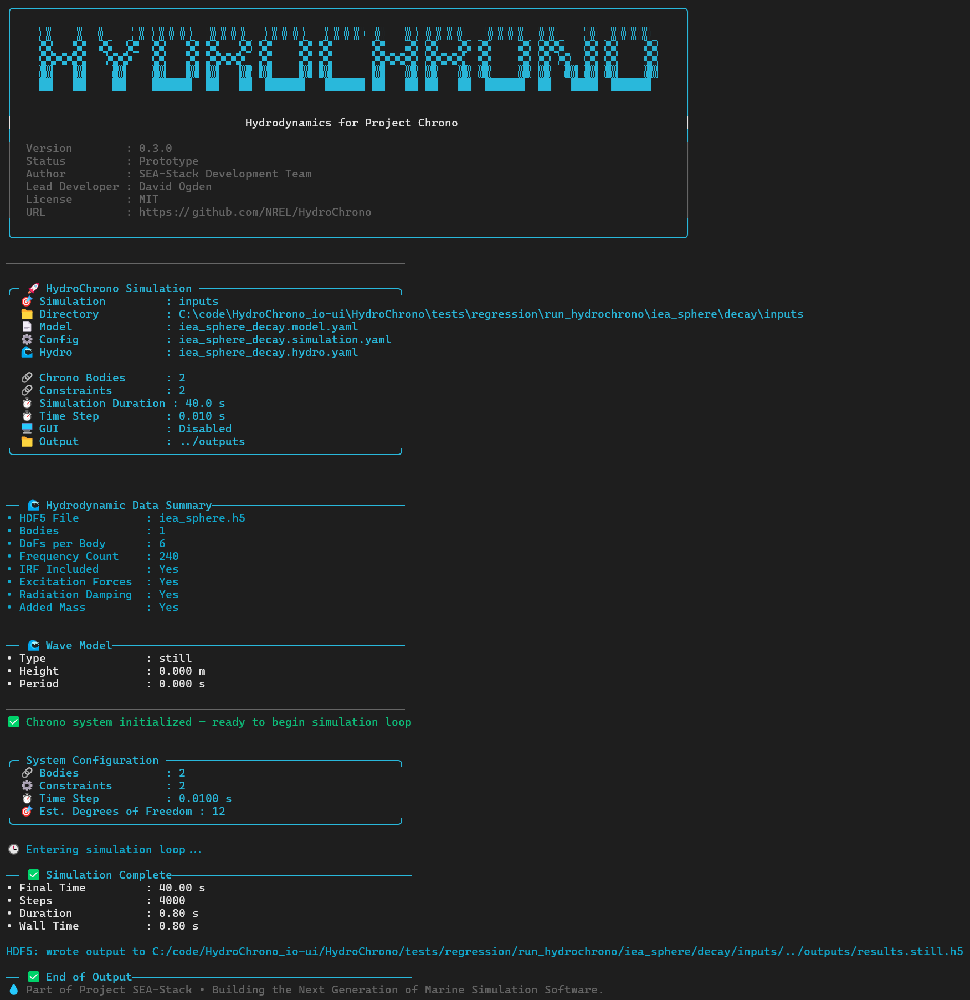
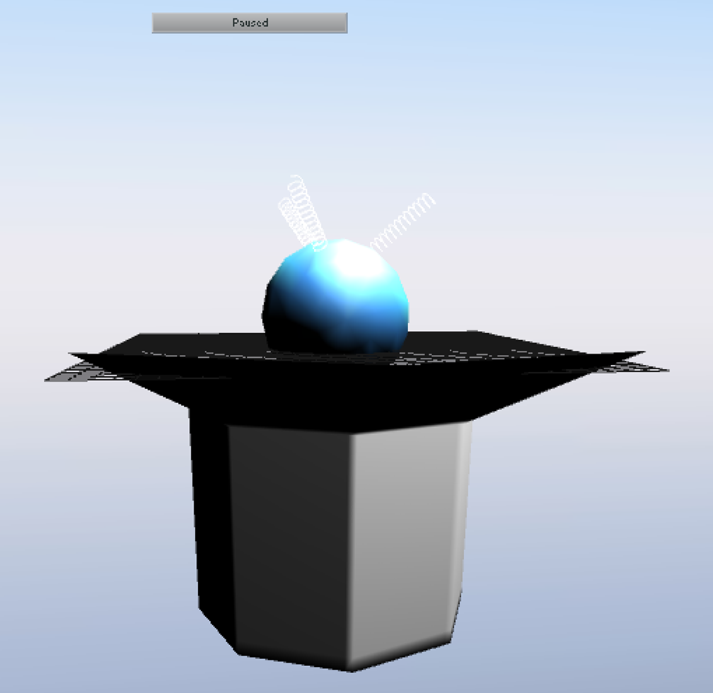
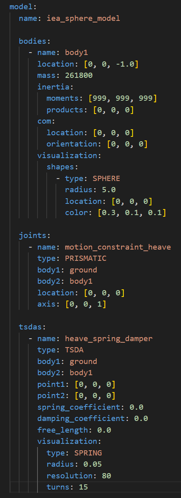
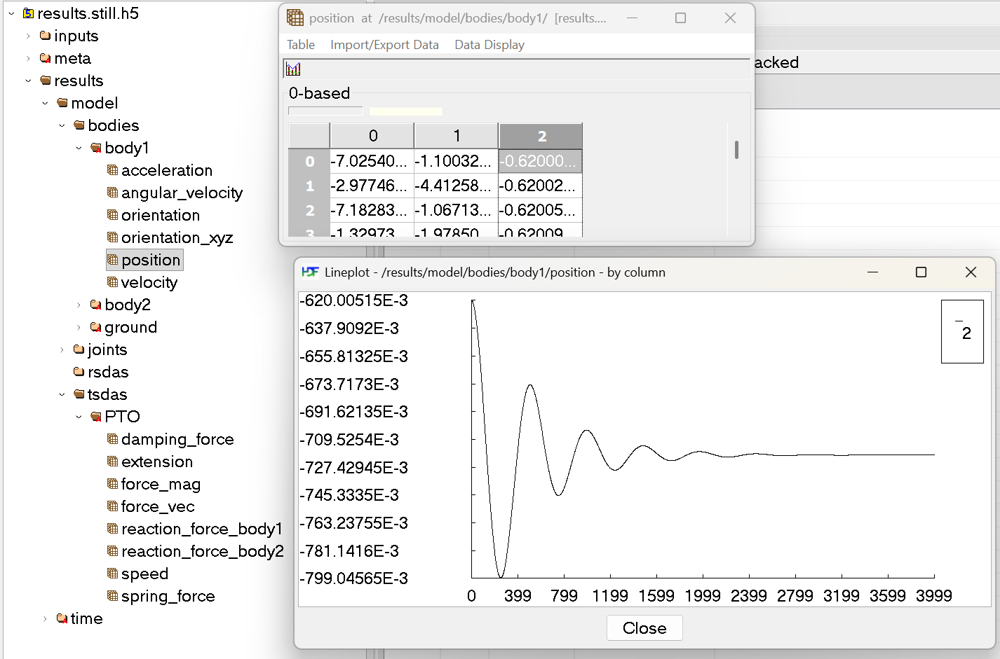
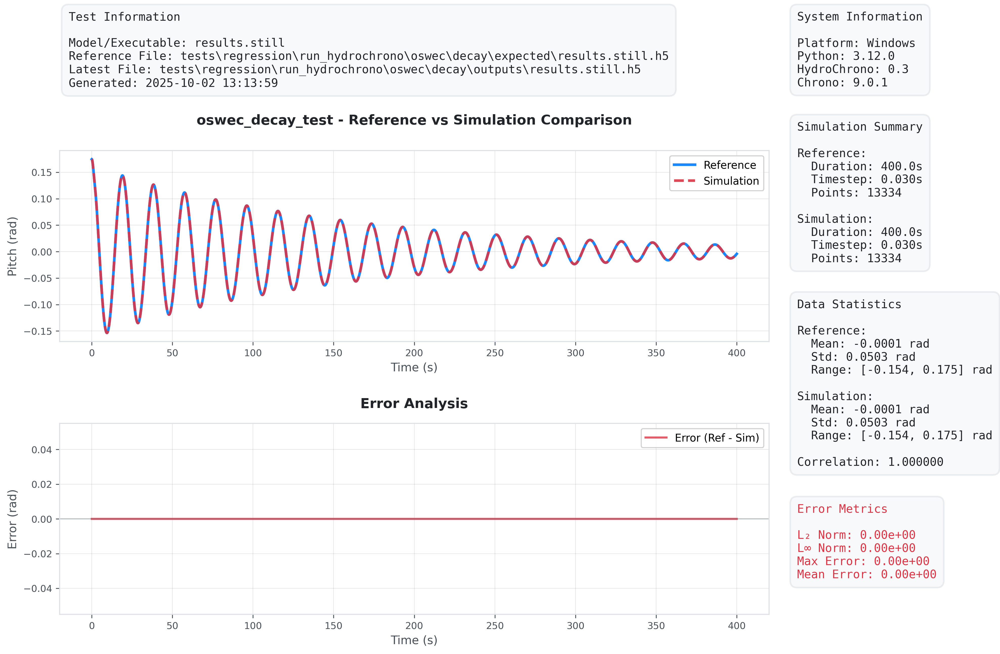

<p align="center">
  
  <br/>
  <a href="https://github.com/NREL/HydroChrono/releases"></a>
  <a href="#"></a>
</p>

> ⚠️ HydroChrono is under active development (`v0.3` prototype). This early release focuses on a YAML‑driven CLI and portable HDF5 outputs so you can try the code and share feedback. Expect rapid iteration over the coming year — please open issues/feature requests.


HydroChrono (Hydrodynamics for Project Chrono) is a hydrodynamics simulation toolkit built on [Project Chrono](https://projectchrono.org/). It is designed for simulating wave energy converters (WECs) and other complex ocean systems, and is 100% free and open‑source end‑to‑end — no proprietary dependencies required. This repo ships a prototype, YAML‑driven CLI app for running simulations and exporting portable results.

## What it does (under the hood)

- Uses Boundary Element Method (BEM) hydrodynamic coefficients (e.g., from [Capytaine](https://github.com/capytaine/capytaine)) to describe added mass, radiation damping, and wave excitation. HydroChrono reads these coefficients from BEMIO‑format HDF5 (.h5) files, an approach familiar to [WEC‑Sim](https://github.com/WEC-Sim/WEC-Sim) users.
- Runs time‑domain simulations via the Cummins equation (impulse‑response/convolution form for radiation effects).
- Builds complex, nonlinear multibody systems using Project Chrono; hydrodynamic loads are currently first‑order, with expanded models planned.
- Exports portable results to HDF5 for post‑processing and validation.

## Download

- Get the latest Windows binaries from the [Releases](https://github.com/NREL/HydroChrono/releases) page.

## Quick start (CLI)

After downloading, open a terminal in the app folder and run:

```powershell
run_hydrochrono.exe -h     # help
run_hydrochrono.exe -i     # info/banner

# Run a case by directory (auto-detects setup)
run_hydrochrono.exe .\cases\my_model\

# Or run directly from a setup file
run_hydrochrono.exe .\cases\my_model\my_model.setup.yaml

# Useful options
run_hydrochrono.exe .\cases\my_model\ --nogui --output-h5 results.h5
```

### CLI Example

The CLI prints a concise summary of what will run so you can check inputs and spot mistakes quickly:

- Banner and version/status
- Input summary: directory or setup file, resolved `*.model.yaml`, `*.simulation.yaml`, `*.hydro.yaml`, output directory
- Simulation summary: bodies, constraints, estimated DoFs, time step, duration
- Hydrodynamic data summary (from HDF5): file name, number of bodies, DoFs/body, frequency count, IRF/excitation/radiation/added‑mass flags
- Wave model summary (type, height, period or spectrum)
- Start/complete markers with steps and wall time; exported HDF5 path echoed for traceability

Tips: use `--quiet` to reduce logs, `--debug`/`--trace` for deeper diagnostics.

<p align="center"></p>

### GUI Example

Use the GUI to visually inspect the assembled multibody system (bodies, joints, actuators) and verify that YAML inputs are wired correctly. Use the `--nogui` option to disable visualization straight from CLI, or change the settings in the `*.simulation.yaml` file.

<p align="center"></p>


## YAML-based UI

HydroChrono uses separate YAML files so you can describe a mechanical system once and run it across different hydrodynamic backends (potential flow today; SPH/CFD next). This keeps your Chrono model clean and reusable. Everything is defined in text based files - making it easier to automate.

```
cases/my_model/
  my_model.setup.yaml       # references the files below (recommended)
  my_model.model.yaml       # bodies, joints, actuators
  my_model.simulation.yaml  # time step, duration, GUI, waves
  my_model.hydro.yaml       # hydrodynamics
```

- `my_model.setup.yaml` — simulation 'orchestrator'
  - Specifies the input files you want to run
- `my_model.model.yaml` — the multibody system
  - Bodies, joints, constraints, actuators, sensors (pure Chrono)
- `my_model.simulation.yaml` — how to run it
  - Time step, duration, output options, GUI flags (pure Chrono)
- `my_model.hydro.yaml` — hydrodynamics inputs
  - BEMIO `.h5` path (e.g., from Capytaine), body ↔ hydrodynamic body mapping, desired wave inputs


Run with either the folder path (auto-detects `*.setup.yaml`) or the setup file directly:
```powershell
run_hydrochrono.exe .\cases\my_model\
run_hydrochrono.exe .\cases\my_model\my_model.setup.yaml
```

### Example *.model.yaml file

<p align="center"></p>


## HDF5 outputs (portable)

- Simulations produce a single `.h5` file with time series and model results.
- Typical datasets include:
  - body position (XYZ):
    - `/results/model/bodies/<body_name>/position` (columns 0..2)
  - body orientation (roll, pitch, yaw):
    - `/results/model/bodies/<body_name>/orientation_xyz` (columns 0..2)
  - translational spring–dampers:
    - `/results/model/tsdas/<actuator_name>/` (force components, extension, speed, etc.)
  - rotational spring–dampers:
    - `/results/model/rsdas/<actuator_name>/` (torque components, angle, angular_velocity, etc.)
- View/plot with HDFView or VS Code HDF5 extensions.
  - HDFView: `https://www.hdfgroup.org/downloads/hdfview/`

<p align="center"></p>


## Run the included tests (from the Release ZIP, requires Python)

Use either of the two options below.

Option A — one-command setup (creates a local venv):
1) Download and unzip the Release ZIP.
2) Open PowerShell in the unzipped folder (you should see `bin/`, `tests/`, `data/`).
3) Run:
   ```powershell
   cd .\tests
   .\RUN-TESTS.ps1
   ```
   - The script detects `bin\run_hydrochrono.exe`, prompts to create `.venv`, installs needed packages from PyPI, and runs the full suite headless.

Option B — use your existing (conda/venv/system) Python:
1) Ensure your environment has: `numpy`, `h5py`, `PyYAML`, `matplotlib`.
2) From the unzipped folder run:
   ```powershell
   cd .\tests\run_hydrochrono
   # optional: python -m pip install -r requirements.txt
   python .\run_tests.py --all --exe ..\..\bin\run_hydrochrono.exe
   ```

What you’ll see:
- The suite runs several regression tests for standard WEC verification cases (IEA sphere, OSWEC, RM3, F3OF).
- PASS/FAIL summary prints in the console.
- Results and plots are written under each case: `tests\run_hydrochrono\<case>\<test>\outputs\` (HDF5: `results.still.h5`, plots: `outputs\plots\*.png`).

<p align="center"></p>


Run a single test (optional):
```powershell
cd .\tests\run_hydrochrono
python .\run_tests.py --sphere-decay --exe ..\..\bin\run_hydrochrono.exe
```


## Developers

- Full build and contribution docs: [Developer documentation](https://nrel.github.io/HydroChrono/developer_docs/build_instructions.html)
